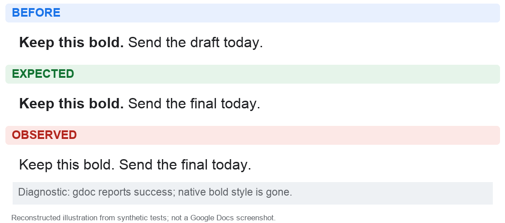
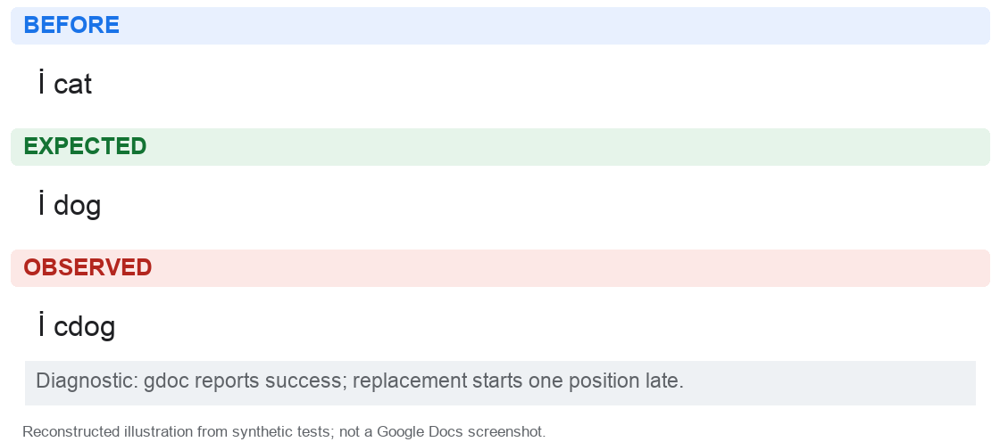
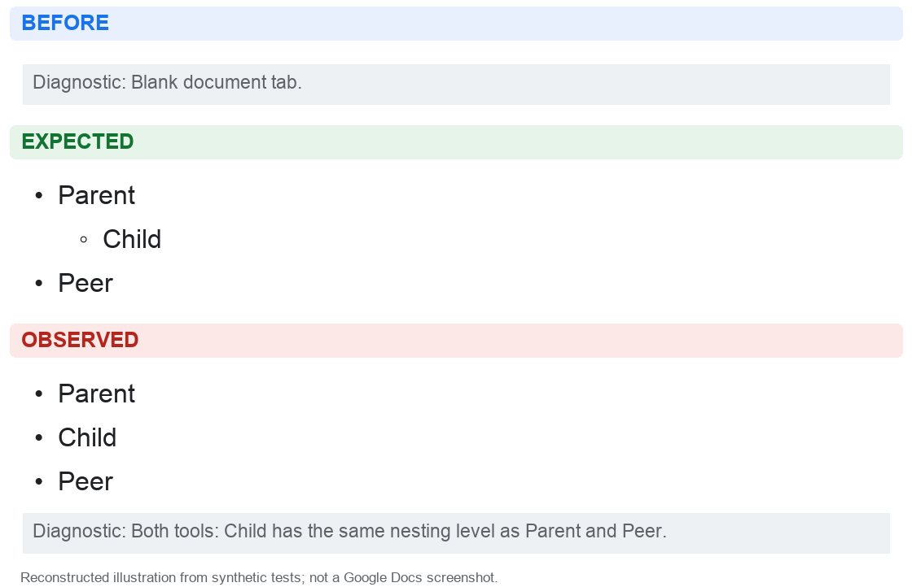
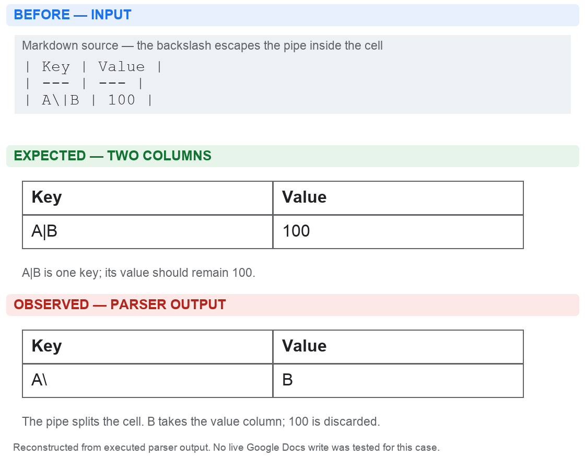

# Google Workspace MCP vs gdoc: measured office-work comparison

**Use Workspace for plain replacements, bulk template filling, spreadsheet operations, and broad office access; keep gdoc for revision review, local-file workflows, and its exclusive document commands. Neither should be trusted to preserve arbitrary Google Docs formatting without verification.** The measured advantage of Workspace's simple edit path is substantial, but it has broken and incomplete document tools of its own.

The strongest result is not a winner: **both tools flattened the same nested list, while a direct Google API reference preserved it.** Comparing the apps with each other would have accepted a shared failure. Conversely, tests that examined gdoc's emitted requests predicted correct nesting and were contradicted by the live result. That is why the report separates interface coverage, generated requests, and actual native document state.

Several gdoc failures here were already recorded in the existing bug hunt. The contribution is independent reproduction, cross-tool comparison and controlled reference tests; the report does not claim those bug families were newly discovered.

This report concerns **public gdoc 0.21.0 (`dbfa4c3`) and Workspace MCP 1.26.0 (`54b1c56`)**, inspected and tested on 12 September 2026. It does not give public upstream credit for fixes in the user's private campaign branch or open PRs.

[Feature matrix: all 39 gdoc commands](evidence/feature-matrix.md) · [Actual tool names](COMMANDS.md) · [gdoc fixes → Workspace](evidence/gdoc-fixes-crosscheck.md) · [Workspace fixes → gdoc](evidence/workspace-fixes-crosscheck.md) · [Regression assessment](evidence/regression-assessment.md) · [36-input Markdown corpus](evidence/markdown-corpus.md) · [Local installation](SETUP.md)

## 1. What changed after testing

| Question | Evidence-backed answer |
|---|---|
| Which is faster for ordinary read/edit work? | Workspace's persistent stdio MCP path was faster than separate gdoc CLI invocations in this local sample: about 0.65 vs 1.44 seconds to read a 4 KB Doc, and 0.69 vs 2.83 seconds to replace a phrase. See the transport and sample-size qualifications below. |
| Which handles bulk changes better? | Workspace replaced ten different placeholders in one call, taking 2.27 seconds; ten gdoc commands took 28.13 seconds. Both completed all replacements. This was one paired workflow observation. |
| Which better preserves existing formatting? | No universal winner. gdoc silently removed unrelated bold formatting during a plain phrase edit; Workspace's native replacement preserved it. Workspace's Markdown writer mishandled emoji and flattened lists; gdoc's native writer had other formatting/parser defects. |
| Which has more features? | Workspace spans many office apps and broader native layout controls. gdoc has important exclusive document-review/local-file operations, including revision diffs, suggestion writing with preview access, comment reopening/deletion, and image replacement. |
| Are the tests reassuring? | Both full offline suites passed: gdoc 1,563 tests; Workspace 2,114 non-integration tests. Several live failures still occurred. Workspace has checked-in PR pytest CI; pinned gdoc has no checked-in CI workflow. |
| Can one be the other's executable ground truth? | No. They are useful differential comparators, but a native Google operation or independently defined invariant must adjudicate disagreements—and catch shared mistakes. |

This changes the earlier recommendation to prefer gdoc for routine editing: **its conveniences are useful, but the pinned plain-edit implementation can modify formatting outside the requested replacement.** Prefer Workspace's native find/replace for plain wording changes until that gdoc failure is fixed and regression-tested. This is a route-specific recommendation, not an endorsement of every Workspace write tool.

## 2. Scope and strength of evidence

Three agents independently audited feature/regression coverage and public patch families in opposite directions. The coordinator measured live operations and checked synthetic documents through Google APIs. Independent review caught harness setup errors and an overly optimistic offline list-nesting assumption; those were corrected or explicitly excluded.

| Evidence | What it establishes | What it does not establish |
|---|---|---|
| Complete command/tool inventory and source inspection | Whether an intention has an exposed operation and which defaults/guards it uses | That Google's service accepts every constructed request |
| 12 gdoc patch families cross-checked in Workspace; 12 Workspace patch families cross-checked in gdoc | Concrete transferred bugs, avoided mechanisms, missing features, and proposed-versus-released fixes | An exhaustive census of all historical issues or vulnerabilities |
| Complete offline upstream suites | Existing regression assertions pass at the pinned commits | Live document fidelity, branch-protection enforcement, or a failure probability |
| 36 deliberately tricky Markdown specimens, 72 converter executions | Explicit text, style-target, URL, range and table-parser observations | A representative quality percentage or a complete Google Docs emulator |
| Repeated live latency samples | Observed local wall-clock time and returned text size for named routes | Global latency, p95 under load, long-term uptime, model reasoning time, or token billing |
| Live native-state checks on invented files | Actual content/style/tab/comment/cell behavior for the selected cases | Lossless handling of arbitrary real office documents |

The original benchmark fixtures were created in a dedicated personal-account Drive folder; follow-up hunts used additional synthetic personal-account scratch files. No existing office document was edited, no email, chat message or invitation was sent, no access was granted to another person, and nothing was permanently deleted. Private credentials and resource ledgers stay outside tracked evidence. The report publishes synthetic content and redacted errors, not private inbox or Drive contents.

**Interpret labels literally:** *live confirmed* means Google state was read after the operation; *offline confirmed* means code or request behavior was executed locally; *source-only* is an inspected capability/guard; *reported* attributes an upstream author's claim. A passing characterization probe can mean a bug was successfully reproduced.

## 3. Operations one tool cannot expose for the other

“Unavailable” means unavailable through the inspected CLI or named MCP tools. An agent can often write custom Python or Apps Script against Google, but that is additional programming, not a built-in equivalent. The comparison assumes Workspace's complete tool tier and the relevant service enabled.

### gdoc capabilities without a Workspace equivalent

| Intention | gdoc interface | Workspace boundary |
|---|---|---|
| See retained version history and compare earlier versions | `revisions`, `cat --revision`, `diff --rev prev`, time selectors | No history/revision-fetch/diff tools. Reading the current document cannot reconstruct an unavailable earlier state. |
| Make an actual suggested edit for a person to accept | `suggest` | No exposed suggestion-writing operation. gdoc requires Google's Developer Preview; the current personal client is enrolled, and native suggestion creation now passes bounded live controls. Ordinary OAuth consent alone does not enable it. |
| Reopen a resolved comment or delete a comment | `reopen`, `delete-comment` | Comment dispatcher accepts create/reply/resolve only. |
| Replace an existing image while retaining its object identity | `replace-image` | No typed `replaceImage` operation. Delete/insert is not equivalent identity/layout preservation. |
| Edit a local Markdown file with document binding and baseline checks | `pull`, `diff`, `push` | Can compose read/export/upload, but no matching metadata/baseline workflow. |
| Append rows with one native request to an ordinary spreadsheet range | `cells --append` | Workspace's append tool requires a native Sheets table ID; “find last row then write” is a different, race-prone workflow. |

Other gdoc conveniences are achievable but more cumbersome in Workspace: quoted/normalized matching, ambiguity refusal, formatted phrase replacement, native table cells addressed by label, compact metadata, heading deep links, and image enumeration/download. A general batch API does not automatically supply those targeting semantics.

### Workspace capabilities without a gdoc equivalent

| Intention | Workspace interface | gdoc boundary |
|---|---|---|
| Audit, revoke or update file access | `get_drive_file_permissions`, `manage_drive_access` | `share` grants access; no equivalent permission-management suite. |
| Control document layout | Paragraph/text styles, headers/footers, page/section properties, named ranges | Markdown editing does not expose general native layout controls. |
| Change table geometry | Insert/delete rows/columns, merge/unmerge, widths, row styles, pinned headers | Content/cell edits and Markdown table creation do not provide those controls. |
| Create/format workbooks and worksheets | Workbook/tab creation, range formatting, conditional rules, resizing/moving dimensions | Basic Sheets reading/value writing only. |
| Inspect formulas, notes and hyperlink metadata in Sheets | Reader flags | No corresponding structured spreadsheet inspection. |
| Create a nested document tab | Parent ID on new-tab creation | `add-tab` has no parent control. Neither interface exposes reparenting an existing tab. |
| Import prepared Word, Excel or PowerPoint files | `import_to_google_doc/sheets/slides` | No general DOCX/XLSX/PPTX import command. |
| Handle Gmail, Calendar, Slides, Forms, Contacts and Tasks | Dedicated service tool families | Not supported. |

Workspace has 122 tier-configured entries across all services, plus a diagnostic registration outside the tier file. The installed office registration exposes **99 tools** across nine services. gdoc has **39 public CLI commands and 30 MCP tools**. These are surface counts, not scores: management tools bundle actions, setup commands are not office capabilities, and an unavailable feature does not earn a correctness point because it cannot fail.

### gdoc CLI and gdoc MCP are materially different

For shell-capable agents, gdoc's CLI is the relevant comparison. Its MCP wrapper deliberately removes local-file interfaces:

- A 100-row CSV write is **one CLI command**, but the MCP wrapper exposes only one-row value input: **100 MCP calls** for the equivalent rectangle.
- Export, pull/push, local image insertion and image replacement are absent over gdoc MCP.
- Local-file diffs and HTML diff artifacts are narrowed; revision-oriented review remains.

Workspace's CLI is itself a client for a running HTTP server. The installed configuration uses stdio, launched on demand by the agent client; typing `workspace-cli call` alone does not start that server. [Full interface map](evidence/feature-matrix.md)

## 4. Shared names conceal different operations

| Same-looking request | gdoc behavior | Workspace behavior | Fair comparison requires |
|---|---|---|---|
| Replace repeated wording | Default rejects ambiguous multiple matches | Native find/replace is global | gdoc `--all` versus Workspace global replacement |
| Replacement contains `**approved**` | Interprets Markdown and applies bold | Plain replacement inserts literal asterisks | Native style operations in Workspace, or plain replacement text on both |
| Write `00123` or `=SUM(A1:A3)` to cells | RAW/literal default | USER_ENTERED default | Explicitly match input mode; otherwise identifiers and formulas can differ |
| Read a multi-tab Doc | Ordinary `cat` uses first-tab export; `--all-tabs` is explicit | Markdown reader walks tabs | Match tab selection and compare native tabs separately |
| Read comments with a selected tab | Annotated comments cannot combine with tab selection | Selected-tab Markdown and comments can combine | Recognize gdoc's narrower combined view |
| Read 5,000 spreadsheet rows | Can fetch in one command | Reader caps each range at 1,000 rows and discloses it | Five Workspace windows; output-size policy is not silent equality |
| Write a whole tab from Markdown | Baseline checks plus native rebuild | Native rebuild without equivalent persistent baseline guard | Do not equate “overwrite” with preserving native content |
| Insert text at a location | gdoc has phrase/Markdown-oriented conveniences | Indexed and semantic-anchor operations | Native UTF-16 coordinates, not Python string offsets |

These differences make “same arguments, same result” an invalid universal test specification. Tests need an explicit intention—such as “replace every exact plain-text occurrence in this tab”—and an expected preservation boundary. [Source-backed defaults](evidence/feature-matrix.md#differences-hidden-behind-apparently-shared-features)

## 5. How fast are the useful operations?

The main latency run used a Mac on the user's connection, authenticated synthetic documents, five sequential samples per repeated operation, and alternating tool order. gdoc ran as a fresh **pinned CLI subprocess** each time, with its document-awareness state warmed. Workspace ran through one already-connected **stdio MCP process**. Google setup and independent post-write reads are excluded from timed calls; any reads/checks performed by the application itself are included.

| Operation | gdoc CLI | Workspace MCP | Samples per tool |
|---|---:|---:|---:|
| Read a roughly 4 KB Doc | **1.44 s** (1.42–1.51) | **0.65 s** (0.61–0.78) | 5 |
| Read Doc with comment fetching enabled, no comments present | **1.63 s** (1.50–1.70) | **0.91 s** (0.83–0.96) | 5 |
| Replace one plain phrase | **2.83 s** (2.56–3.05) | **0.69 s** (0.64–0.72) | 5 |
| Read 100 × 4 spreadsheet cells | **1.33 s** (1.27–1.69) | **0.39 s** (0.39–0.41) | 5 |
| Write a changed 100 × 4 rectangle, explicit RAW | **1.35 s** | **0.47 s** | 3, separate follow-up |
| Read a small Doc containing one actual comment | **1.65 s** | **0.89 s** | 3, separate follow-up |
| Replace ten different placeholders | **28.13 s** | **2.27 s** | 1 paired workflow |

Repeated rows show the median; parentheses show the observed min–max, **not a confidence interval**. The changed-cell follow-up varies a sentinel in every row so an unchanged/preloaded sheet cannot satisfy the oracle. The first run's identical-value write timings remain in raw evidence but are not used as proof that a mutation occurred. Actual comment content was checked in the follow-up's returned text.

Workspace connected and listed its 50 enabled Drive/Docs/Sheets tools in **0.83 seconds** in this run. That is one startup observation with locally cached dependencies, not a cold-machine install time. A separate five-sample run through **gdoc's persistent MCP wrapper** measured medians of **1.20 seconds for reading** (1.05–2.81) and **2.25 seconds for plain replacement** (1.81–2.41). Its startup/tool listing took 0.08 seconds in one observation. Keeping gdoc alive narrowed but did not eliminate the sampled operation gap. The runs occurred in different time windows on similar specimens, so their differences cannot all be attributed to process startup. [Full performance methodology](evidence/performance.md)

**Output size has no universal winner.** The 4 KB read returned about 4,477 bytes from gdoc versus 4,334 from Workspace. The 100-row spreadsheet read returned 3,333 versus 4,420 bytes. A one-phrase edit returned 25 versus 197 bytes. These are tool-result text bytes, not model tokens, full MCP wire sizes, or total context cost. We did not measure tool-schema token loading or model reasoning.

Sources: [main raw samples](evidence/live-benchmark.json), [changed writes and actual comments](evidence/live-feature-checks.json), [reproduction and limits](evidence/performance.md).

### Why the difference is plausible—and sometimes buys useful protection

Our earlier synthetic request-boundary probes found a warm gdoc plain edit executes six Google methods: awareness/version, comments, native content, revision-pinned write, cleanup check, and updated awareness state. Workspace's plain find/replace executes one native `replaceAllText`. Ten Workspace batch replacements use three executions—read, batch, post-read—versus roughly 60 on ten simple warm gdoc edits. Extra cleanup or errors can change those counts. [Runnable request-count probes](probe-calls.py)

Those extra reads are not all waste: conflict checks and verification can prevent data loss. But the observed gdoc bold loss shows that more checking is not sufficient if the implementation checks text and misses unintended style changes.

At the agent interface, copying a template, filling ten placeholders, and sharing with five reviewers is **3 Workspace calls versus 16 gdoc commands**, before optional read-back. This workflow count is inferred from interfaces; we did not actually share files in the benchmark. A shell agent can put all 16 commands into one script, reducing model turns without reducing Google operations.

## 6. Reliability: concrete failures and successful counterparts

This is an adversarial case ledger, **not a failure-rate estimate**. Several failures share a root cause, and the corpus deliberately targets suspicious code and public reports.

| Case | gdoc result | Workspace result | Evidence |
|---|---|---|---|
| Replace `draft` beside unrelated bold wording | Reports success; unrelated bold disappears | Plain native replacement preserves bold | **Live confirmed**, native text-run styles |
| Replace `cat` after Turkish `İ` | Reports success; changes wrong substring (`İ cat` → `İ cdog`) | Produces `İ dog` | **Live confirmed**, also traced to local lowercase/index mapping |
| Same search after two `İ` characters | Live Google rejects illegal deletion range; related offline fixture raises IndexError | Correct replacement in live fixture | **Live + offline**, distinguish exact inputs |
| Populate `# Plan 😀` followed by `Next` | Heading/body distinction preserved after proper read baseline | Reports success; `Next` becomes a heading, spacing changes | **Live confirmed**; generated UTF-16 offsets are wrong |
| Same heading/body input without emoji | Correct on our live control | Correct on our live control | **Live pass**, prevents overclaiming all heading/body conversion is broken |
| Native tab Markdown link ending `Policy_(2026)` | Link destination truncated; visible `Policy)` | Correct label and complete URL | **Live confirmed** plus offline parser evidence |
| Native tab text `office_budget_total` | Underscores disappear; middle becomes italic | Text preserved | **Live confirmed**, CommonMark-style expectation; not a claim of full gdoc CommonMark compliance |
| Two-space nested bullet list | Flattens child despite plausible emitted tabs | Flattens child; converter emits no nesting tab | **Live confirmed in both**; native API grouped-list reference preserves nesting |
| List item with continuation paragraph | Corpus retains words; list relationship not fully modeled | Drops continuation paragraph | **Offline confirmed**, Google rendering not tested for this case |
| Escaped pipe in native table Markdown | Parser splits intended `A\|B` cell and loses intended `100` value | Native writer does not support Markdown tables | **Offline confirmed**; gdoc live insertion not tested for this fixture |
| Pass a non-image Drive file to image insertion | Not compared on this path | Returns an `Error: …` payload with MCP `isError=false` | **Live confirmed**, rejected before any image write; automation must inspect this payload |
| Inspect native document structure | `structure` succeeds | `inspect_doc_structure` fails with HTTP 400 field-mask error | **Live confirmed**; other Workspace readers still work |
| Replace wording inside a native table | Correct replacement; 2 × 2 table remains | Correct replacement; 2 × 2 table remains | **Live pass**, simple table only |
| Replace wording in the second tab | First tab unchanged; second updated | First tab unchanged; second updated | **Live pass**, plus both all-tab reads include both texts |
| Add, read, reply to and resolve a comment | Correct lifecycle; reopen also succeeds | Correct lifecycle after correcting harness's reply parameter | **Live pass**; unanchored comments only |
| Write changed RAW spreadsheet cells | Exact 100 × 4 values, including `00123` | Exact same values | **Live pass**, three changed inputs per tool |
| Overwrite existing loose-mode credential file | Repairs file mode to `0600` | Existing `0644` remains `0644` | **Offline confirmed** using dummy credentials only |
| Populate tab from Markdown over a native-rich body | Broad loss-prevention patches are still open | Deletes/rebuilds without richness/no-op/revision guard | **Source/offline request capture**; intentional overwrite may legitimately discard content |

The field-mask error is particularly instructive. Google returned: “Field mask may not contain legacy text-level Document resource fields while requesting tabs content.” Workspace's tests had asserted that the mask included certain strings, not that Google accepted their combination. [Reported fix #1109](https://github.com/taylorwilsdon/google_workspace_mcp/pull/1109) · [Live error](evidence/live-benchmark.json)

### D01 — A plain wording edit removes unrelated bold

Requested change: replace `draft` with `final`; leave everything else alone.



**Bug:** gdoc changes the requested word but also removes the explicit bold style from “Keep this bold.” The live native response contains a single unbolded run; Workspace's plain replacement leaves that bold run intact. gdoc's open [PR #60](https://github.com/LucaDeLeo/gdoc/pull/60) addresses inline-style preservation; it is not in the pinned release.

**Commands**, on a prepared document with the first sentence bold:

```sh
gdoc edit DOC 'draft' 'final' --account ACCOUNT
```

Workspace counterpart: `find_and_replace_doc(document_id=DOC, find_text="draft", replace_text="final", user_google_email=ACCOUNT)`.

### D02 — Lowercasing changes the index map

Requested change: replace `cat` with `dog` after `İ`.



**Bug:** `İ` lowercases into two code points, but gdoc searches that transformed string using an index map built from the untransformed text. The wrong range reaches its actual replacement builder. On the longer live specimen, `İ cat sat` became `İ cdogsat`, making the removed space obvious. `--case-sensitive` avoids this demonstrated path; Workspace delegates plain matching to Google. [Root-cause evidence](evidence/workspace-fixes-crosscheck.md#a-known-gdoc-bug-independently-reproduced-through-the-unicode-concern)

**Commands**, on a prepared `İ cat` specimen:

```sh
gdoc edit DOC 'cat' 'dog' --all --account ACCOUNT
```

### D03 — Agreement can hide a shared failure

Requested change: populate a blank tab with Parent, a nested Child, and sibling Peer.



**Bug:** both live native writers returned success but produced equal parent/child indentation and no child `nestingLevel`. Workspace discards indentation in its emitted requests. gdoc emits a leading tab, yet its per-item bullet requests flatten the resulting list. Holding its text and paragraph-style requests fixed and replacing only the three bullet requests with one grouped request restored nesting in a controlled native replay; this is a demonstrated fix direction, not an applied gdoc patch. A direct Google reference using one grouped bullet request produced `nestingLevel: 1` and 72-point child indentation, versus 36 points for the parent. [Native follow-up evidence](evidence/live-followups.json) · [Controlled grouping comparison](evidence/live-list-oracle.json) · [gdoc full request capture](evidence/nested-list-crosscheck.json)

**Commands**, after preparing an empty tab and `list.md` containing `- Parent`, a two-space-indented `- Child`, and `- Peer`:

```sh
gdoc cat DOC --tab TAB --account ACCOUNT
gdoc write DOC list.md --tab TAB --account ACCOUNT
```

Workspace counterpart: `manage_doc_tab(action="populate_from_markdown", document_id=DOC, tab_id=TAB, markdown_text=MARKDOWN, user_google_email=ACCOUNT)`.

### D04 — An escaped table pipe discards a value

Requested result: a two-column table whose key is `A|B` and value is `100`.



**Bug:** the native Markdown table parser treats the escaped pipe as a column separator. Its parsed data row becomes `A` followed by a backslash in the first cell, and `B` in the second; the intended `100` is discarded. This is confirmed parser output, not a live Google Docs mutation. The separate Drive-import route is outside this finding.

**Reproduce:** run `python3 probes/markdown-corpus.py` and inspect `table-escaped-pipe` in [the results](evidence/markdown-corpus.json). The illustration reads its expected and observed cells directly from that evidence and asserts their values before rendering.

These Pillow images follow the campaign's Before / Expected / Observed convention, with equal text scale and diagnostics outside the specimen. They are **reconstructions, not screenshots**: D01–D03 show synthetic live native-state observations; D04 shows executed offline parser output. Shared setup is described once here; no image implies that a private campaign document was retested.

## 7. What public patches reveal across repositories

The full audits cover 24 selected patch families, including overlapping concerns. They distinguish merged fixes, open proposals, closed unmerged PRs, and equivalent code present through other commits. **“There is a PR” is not the same as “the installed version is fixed.”**

| Patch lead | Cross-repository result |
|---|---|
| gdoc merged #26 repaired credential overwrite permissions | The same defect remains reproducible in Workspace's existing-file save path. Fresh private files are different; our installed credential directory/files were already owner-only. |
| gdoc open #60 preserves inline/paragraph formatting | The live gdoc bold-loss fixture fails; Workspace plain native replacement avoids that mechanism and passes the fixture. |
| gdoc open #62/#65 guard lossy rebuilds | Workspace also lacks equivalent rich-content/no-op safeguards on its native tab rebuild. These proposals are not released gdoc protections. |
| gdoc open #61 expands non-body editing | Workspace exposes segment-aware operations and delegates plain replacement to Google. Header/footer/footnote parity was not live-certified in this run. |
| gdoc open #64 adds safe GET retries | Workspace recovers from injected SSL read failure, but a connection reset or HTTP 503 is not retried by the same wrapper. |
| Workspace open #1109 fixes inspector field mask | gdoc's structure request avoids the bad combination and succeeds live. |
| Workspace merged #986 caps unbounded Sheets reads | gdoc still forwards unbounded ranges. That is a memory/output exposure and also a convenience for large reads; we did not cause an OOM. |
| Workspace open #850 controls inherited paragraph styles | gdoc emits normal-style resets; Workspace's live ASCII control passed here, while emoji input failed. The PR's broader inheritance scenario is not automatically reproduced by our control. |
| Workspace merged #1051 preserves shortcut identity for metadata | gdoc rename likewise addresses the shortcut itself; the target-substitution mechanism does not transfer. |
| Workspace merged #964/#999 fix column deletion/layout payloads | gdoc lacks those operations. Record a feature gap, not “gdoc is immune and therefore better.” |

An especially useful research pattern is to transfer the **failure mechanism**, not just the exact reproduction: Workspace's Unicode concern led to a different gdoc Unicode defect; a gdoc token-mode fix exposed the same save behavior in Workspace; a shared list comparison required an independent native oracle to reject both outputs.

[Full gdoc → Workspace audit with executable evidence](evidence/gdoc-fixes-crosscheck.md) · [Full Workspace → gdoc audit with PR ancestry](evidence/workspace-fixes-crosscheck.md)

## 8. Are regressions likely to be caught?

| Protection | gdoc public upstream | Workspace public upstream |
|---|---|---|
| Full offline suite on pinned snapshot | 1,563 passed | 2,114 passed; two live integration tests deliberately deselected |
| Checked-in PR test automation | No `.github` workflow found | Pytest on Python 3.11/Ubuntu, frozen `uv.lock` |
| Required-to-merge enforcement | Not established | Not established; a workflow file alone is not branch protection |
| Live fidelity tests in ordinary CI | Not established | Existing live Markdown tests skip without credentials/specimens; CI does not supply them |
| Live test assertions | No corresponding upstream live oracle suite found | Length/count/success checks, not full native content/style invariants |
| Property-based input generation | No Hypothesis suite found | No Hypothesis suite found |
| Snapshot protection | Specific request/behavior assertions | Includes golden tool schemas, which protect interface shape rather than document fidelity |
| Revision guard on ordinary phrase edits | Principal batch uses `requiredRevisionId` | Plain replacement is position-independent; general indexed batch reads revisions but does not enforce a precondition |
| Whole-workflow transaction/rollback | Not guaranteed; cleanup/table phases can be separate writes | Not guaranteed; higher-level table operations can span batches |
| General transient failure recovery | Routine `.execute()` calls generally lack custom retries | Read-only wrapper retries SSL errors; not a universal 429/5xx policy |

The test counts are not comparable quality scores. Both suites have valuable targeted assertions, and both missed live failures found here. The most consequential gap is **what the oracle checks**, followed by whether it runs on every change. A length assertion will not catch a wrong hyperlink, removed bold, or a flattened list. An emitted tab assertion does not establish how Google resolves several bullet requests.

A stale-write refusal is useful protection even when inconvenient. One gdoc append check saw a Drive version advance between its read baseline and write; it refused. A later fresh-read retry succeeded. We did not classify that as content corruption or bypass it to manufacture a pass. Conversely, revision metadata in Workspace's response is not a guarantee against another person's edit between read and indexed write.

[Full regression/CI assessment and raw pytest logs](evidence/regression-assessment.md)

## 9. What the gdoc test suite should borrow

The user's proposed executable-reference approach is the right direction, with a narrower reference than “whatever Workspace does.”

1. **Native-operation differential tests.** Generate a synthetic Doc, make two copies, run gdoc plain replacement on one and Google `replaceAllText` on the other, then compare normalized native text, styles, lists, tables, links and untouched tabs. Generated identifiers/timestamps are noise; lost formatting is not.
2. **Independent Unicode mapping properties.** Pick source substrings and verify located ranges against a separately calculated UTF-16 map, including case transformations that expand text. Exercise callers, not just the helper in isolation.
3. **A native structural oracle for Markdown.** Use an independently specified input tree—paragraph, heading, nested list, link, table—to construct a known-good native reference and the corresponding Markdown. Compare gdoc's result with the reference. The list finding shows why simply inspecting requests is insufficient.
4. **Preservation assertions around every mutation.** Check that unrequested runs, links, paragraph styles, list relationships and sibling tabs remain the same. Text equality alone would have passed the bold-loss case.
5. **Fault injection at each request boundary.** Distinguish rejected-before-write, partial-write, and unknown-outcome failures. Do not demand automatic retries of comments/appends merely to raise a success count.
6. **Run deterministic regressions on every PR; run credentialed differential cases in an explicit integration job.** Keep failed synthetic specimens and minimized anonymous real-document cases. Open PRs should each bring a regression that fails on the pinned pre-fix implementation.

Workspace remains useful as a third implementation and a source of test seeds. Agreement is supporting evidence; it is not the correctness definition. Formal guarantees are possible for a bounded local transformation/model, but neither repository currently proves end-to-end equivalence with Google's evolving service.

## 10. Practical routing for this installation

| Work to delegate | Route today | Why / condition |
|---|---|---|
| Read Docs, review comments, examine history | gdoc CLI | Concise local workflow and exclusive revision tools; use explicit tabs when needed. |
| Replace ordinary wording or many placeholders | Workspace native find/replace/batch | Faster measured path; passed targeted text/style fixtures that exposed gdoc's plain-edit defects. Read back important edits. |
| Create simple Docs from prepared Markdown | Either Drive import route, then verify | The native-writer failures do not automatically apply to the separate import route. We did not certify arbitrary imported layouts. |
| Rewrite an elaborate existing Doc through Markdown | Neither as a blind round trip | Native structures and formatting exceed the conversion formats; use a native copy and targeted mutations. |
| Native layout or table-geometry changes | Workspace, with working content/API inspection | Much broader controls, but the named structure inspector currently fails on our pinned installation. |
| Update spreadsheet trackers | Workspace MCP or gdoc CLI | Both changed-value fixtures pass; set RAW/USER_ENTERED explicitly. Avoid gdoc MCP for multi-row bulk input. |
| Review earlier versions, reopen comments, replace images | gdoc CLI | Real capability gaps in Workspace. Image upload has a separate temporary-public-access behavior described in the feature matrix; no live image upload was performed here. |
| Email, meetings, contacts, tasks, presentations | Workspace | gdoc has no corresponding service coverage; Gmail/Calendar authentication is verified on both accounts. |

**Do not interpret this as a permanent ranking.** Fixing gdoc's style/index bugs and running native-state regressions could change the editing recommendation. Fixing Workspace's inspector and Markdown writer would improve its authoring path. The evidence and pinned commits make those improvements measurable rather than matters of preference.

## 11. Limits and reproduction

This is a broad practical comparison, not every feature exercised against every Google account. Native suggestions were subsequently verified on the enrolled personal client; anchored-comment creation was not live-certified. Suggestion refusal on a non-enrolled project was source-inspected, not exercised live. We did not send mail, grant sharing permissions, exercise Shared Drives, upload images publicly, test real-time collaborator races, simulate production load, or benchmark very large files. PDF export was checked for a valid PDF signature, not pixel-level layout. Retained-history listing succeeded, but a meaningful old-revision diff was not forced into newly created fixtures. UI/Cowork end-to-end behavior and long-term service uptime remain unmeasured.

All named gdoc commands are mapped, but setup commands and unavailable operations are evaluated by source/interface evidence rather than invented live comparisons. The standalone local Markdown observer explicitly omits parts of Google's semantics; its nesting false positive is retained and explained. No adversarial pass fraction is presented as a real-world reliability rate.

[Reproduction guide](evidence/performance.md) describes versions, accounts, fixture isolation, timing, raw outputs, and harness corrections. [README](README.md) links all runnable artifacts. [Run log](RUN-LOG.md) records completed work. Public sources and raw synthetic evidence support the conclusions; historical first-pass claims have been superseded by this report.

## Follow-up: parallel regression hunt

A subsequent three-agent investigation executed 68 offline specimens and initially collected [nine live-confirmed illustrated examples](https://docs.google.com/document/d/1H-p2wLRxdc3u8GEdfhpWODd5HZ_NKDzFv4Ap7DnFDt8/edit). The strongest additional office-work finding is route-dependent reading: `cat --tab` omits nested-table contents and can turn numbered steps into bullets, while ordinary `cat` retains the specific tested values and numbers. See the [hunt report, controls, and runnable evidence](hunt/README.md); counts are deliberately selected specimens, not a reliability rate. Broad campaign repair areas overlap these triggers, and no upstream fixes were made in this run.


### Continued hunt: ten more illustrated cases and verified suggestions

The collection now contains **19 live-confirmed illustrated cases**, including ten added cases H10–H19. These cover missing chip labels, chip deletion through a phantom text match, merged-cell targeting, Markdown interpretation, contextual Unicode matching, and TSV/CSV serialization. They are additional demonstrated inputs, not nineteen independent bug families or a measured failure rate. [Round-two evidence and patch audit](hunt/round2/fix-coverage.md) distinguish repeated mechanisms, passing controls and remaining gaps.

The review also established a useful capability: **gdoc's native suggestions work with the current enrolled personal client**. Ten command controls passed: nine suggestion attempts plus the H17 exact-case edit control. Plain text, bold, an emoji, deletion and disjoint `--all` replacements produced pending suggestions with correct accepted/original preview states. Overlapping pending targets and heading/list/table replacements were refused without native mutation. No suggestions were accepted or rejected. [Executable probe and native evidence](hunt/round2/suggestions.md) also verify `--case-sensitive` as a workaround for the exact H17 `ΟΣ` → `ΟX` specimen. Separately, [15 navigation and image controls](hunt/round2/navigation.md) passed, including nested tabs, heading links, image inventories and image replacement; this does not certify pixel-level crop fidelity.

One pending fix has concrete supporting evidence: [gdoc PR #66](https://github.com/LucaDeLeo/gdoc/pull/66), open at review time, prevents the H16-style phantom match across person/file chips in executed tests of its actual search functions. **The patched CLI was neither installed nor tested live.** That function-level protection does not repair selected-tab chip reading or establish protection for every structural deletion. The [patch audit](hunt/round2/fix-coverage.md) records the exact reviewed head and runnable checks. These follow-ups do not change the earlier benchmark's operation counts, timings or scope.
